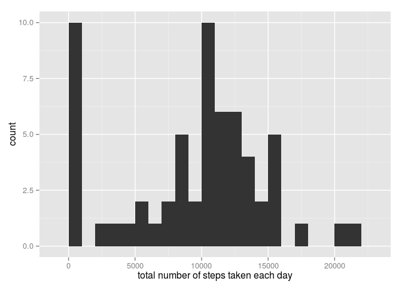
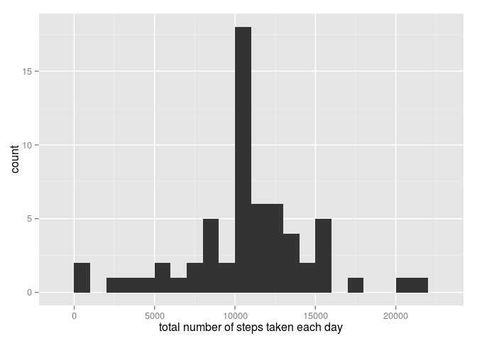
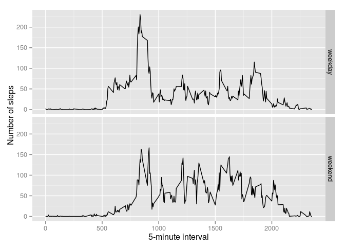

# Reproducible Research: Peer Assessment 1


## Loading and preprocessing the data

```r
if(!file.exists("activity.csv")) unzip(zipfile = "activity.zip")
data <- read.csv("activity.csv")
```


## What is mean total number of steps taken per day?


```r
library(ggplot2)
temp = aggregate(x=list(total_steps=data$steps),by=list(Date=data$date),FUN=sum,na.rm=T)
qplot(temp$total_steps, xlab = "total number of steps taken each day",binwidth = 1000)
```

 

```r
Mean=mean(temp$total_steps)
Median= median(temp$total_steps)
```
**Mean of total number of steps taken per day is : 9354.23**    
**Median of total number of steps taken per day is : 10395**

## What is the average daily activity pattern?


```r
average= aggregate(x=list(steps=data$steps),by=list(interval=data$interval),FUN=mean,na.rm=T)
plot(average$interval,average$steps,type="l",xlab = "5-minute interval",ylab="average number of steps taken")
```

 

```r
average[which.max(average$steps),]
```

```
##     interval    steps
## 104      835 206.1698
```
**interval 835 on average across all the days in the dataset, contains the maximum number of steps.**

## Imputing missing values

```r
sum(is.na(data$steps))
```

```
## [1] 2304
```
** Total number of missing values in the dataset is 2304.**

All of the missing values are filled in with mean value for that 5-minute interval.

```r
NAlocations= which(is.na(data$steps))
FilledNA <- data

fill <- function(steps, interval) {
    filled <- NA
    if (!is.na(steps)) 
          filled <- c(steps) 
    else 
          filled <- (average[average$interval == interval, "steps"])
    return(filled)
}

FilledNA$steps <- mapply(fill, FilledNA$steps, FilledNA$interval)
```
Using the filled data set, let's make a histogram of the total number of steps taken each day and calculate the mean and median total number of steps.


```r
temp = aggregate(x=list(total_steps=FilledNA$steps),by=list(Date=FilledNA$date),FUN=sum)
qplot(temp$total_steps, xlab = "total number of steps taken each day",binwidth = 1000)
```

 

```r
mean(temp$total_steps)
```

```
## [1] 10766.19
```

```r
median(temp$total_steps)
```

```
## [1] 10766.19
```

Mean and median values are higher after imputing missing data.

## Are there differences in activity patterns between weekdays and weekends?
First converting the format to class "Date""

```r
FilledNA$date <- as.Date(FilledNA$date)

weekend <- function(date) {
    day <- weekdays(date)
    if (day %in% c("Monday", "Tuesday", "Wednesday", "Thursday", "Friday")) 
        return("weekday") 
    else if (day %in% c("Saturday", "Sunday")) 
        return("weekend")
}
FilledNA$day <- sapply(FilledNA$date,weekend)
FilledNA$day <- as.factor(FilledNA$day)

average <-  aggregate(x = list(steps=FilledNA$steps),by=list(day=FilledNA$day,interval=FilledNA$interval),mean)
ggplot(average, aes(interval, steps)) + geom_line() + facet_grid(day ~ .) + xlab("5-minute interval") + ylab("Number of steps")
```

 

